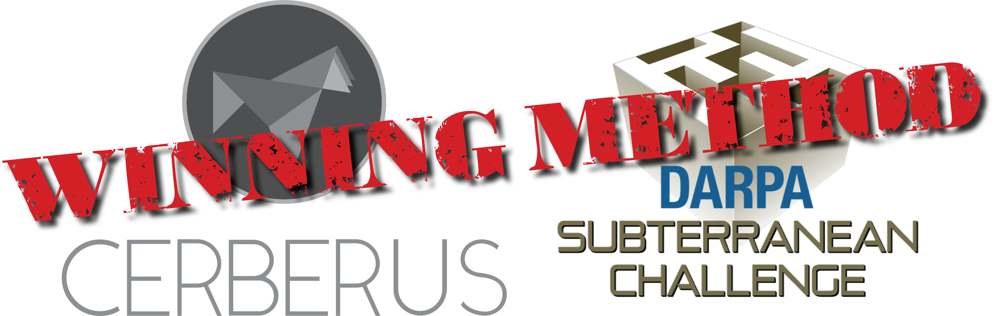
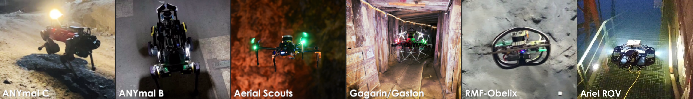

#  <div align="center">**OmniPlanner: Universal Exploration and Inspection Path Planning Across Robot Morphologies (aka GBPlanner 3.0)**</div>

<div align="center"> <a href="https://ntnu-arl.github.io/omniplanner/"></a>  <a href="https://arxiv.org/abs/2603.04284"></a> <a href="https://www.youtube.com/watch?v=kT4hGuejhuQ"></a> </div>

<br>

> **OmniPlanner builds upon GBPlanner 2.0**, the exploration planning method that guided all robots of **Team CERBERUS** during the winning run at the **DARPA Subterranean Challenge**. An updated version of **GBPlanner 2.0** is available in the [`gbplanner2`](https://github.com/ntnu-arl/gbplanner_ros/tree/gbplanner2).

<br>

**OmniPlanner** is a unified graph-based planning framework that enables autonomous robots to explore unknown environments, inspect structures and regions of interest, and navigate to specified targets. Its modular formulation adapts the planning process to the motion and sensing characteristics of aerial, ground, and underwater platforms, allowing the same framework to generate feasible and informative paths across diverse robot morphologies and operating environments.


_**OmniPlanner:** A unified framework for autonomous exploration, inspection, and target-reach planning with aerial, ground, and underwater robots._

For an extensive documentation, installation instructions, and demos please visit the documentation page of the repository here: [**Documetation**](https://github.com/ntnu-arl/gbplanner3_wiki/wiki).


## Setup


### Create workspace for OmniPlanner
```bash
mkdir ~/omniplanner_dev_env
```

### GazeboSim: Garden
If you intend to use the [Gazebo](https://gazebosim.org/home) simulator, you will need to install the Gazebo Garden from source on Ubuntu 20.04 using the following instructions. The instructions have been taken from the original documentation [here](https://gazebosim.org/docs/garden/install_ubuntu_src).

#### Install tools:
```bash
sudo apt install python3-pip lsb-release gnupg curl git
pip3 install vcstool
pip3 install -U colcon-common-extensions
```

#### Create a workspace for gazebo:
```bash
cd ~/omniplanner_dev_env
mkdir -p gazebo_garden_ws/src
cd gazebo_garden_ws/src
```

#### Get source files:
```bash
curl -O https://raw.githubusercontent.com/ntnu-arl/gz-sim/refs/heads/fix/position_control/collection-garden.yaml
vcs import < collection-garden.yaml
```

#### Install dependancies:
```bash
sudo curl https://packages.osrfoundation.org/gazebo.gpg --output /usr/share/keyrings/pkgs-osrf-archive-keyring.gpg
echo "deb [arch=$(dpkg --print-architecture) signed-by=/usr/share/keyrings/pkgs-osrf-archive-keyring.gpg] http://packages.osrfoundation.org/gazebo/ubuntu-stable $(lsb_release -cs) main" | sudo tee /etc/apt/sources.list.d/gazebo-stable.list > /dev/null
sudo apt-get update

cd ~/omniplanner_dev_env/gazebo_garden_ws/src
sudo apt -y install \
  $(sort -u $(find . -iname 'packages-'`lsb_release -cs`'.apt' -o -iname 'packages.apt' | grep -v '/\.git/') | sed '/gz\|sdf/d' | tr '\n' ' ')
```
> **_NOTE:_** Replace the files of the `gz-sim` folder with the files from [this](https://github.com/ntnu-arl/gz-sim/tree/dev/multicopter_control) and switch `gz-common` to 82a649e1 commit.

#### Build:

```bash
cd ~/omniplanner_dev_env/gazebo_garden_ws
colcon graph
colcon build --cmake-args -DBUILD_TESTING=OFF --merge-install
```

#### Source the workspace:
```bash
source ~/omniplanner_dev_env/gazebo_garden_ws/install/setup.bash
```

### ROS-GZ Bridge
#### Create a workspace for gazebo:
```bash
cd ~/omniplanner_dev_env
mkdir -p ros_gz_bridge_ws/src
cd ros_gz_bridge_ws/src
```
#### Clone the bridge:
```bash
git clone git@github.com:ntnu-arl/ros_gz.git -b garden_noetic
cd ~/ros_gz_bridge_ws
catkin config --install
catkin build
```
> **_NOTE:_** Make sure `ros_gz_bridge_ws` extends `~/omniplanner_dev_env/gazebo_garden_ws/install` and `/opt/ros/noetic`.

#### Source the workspace:
```bash
source ~/omniplanner_dev_env/ros_gz_bridge_ws/install/setup.bash
```

## OmniPlanner Installation

#### Install dependancies:
```bash
sudo apt install python3-catkin-tools \
libgoogle-glog-dev \
ros-noetic-joy \
ros-noetic-twist-mux \
ros-noetic-interactive-marker-twist-server \
ros-noetic-octomap-msgs \
ros-noetic-octomap-ros \
git-lfs
```

#### Create the workspace:
```bash
mkdir -p ~/omniplanner_dev_env/omniplanner_ws/src/exploration
cd ~/omniplanner_dev_env/omniplanner_ws/src/exploration
```
#### Clone the planner
```bash
git clone git@github.com:ntnu-arl/gbplanner_ros.git -b gbplanner3
```

#### Clone and update the required packages
```bash
cd ~/omniplanner_dev_env/omniplanner_ws/
vcs import < ./src/exploration/gbplanner_ros/vcstool/packages.repos
cd src/sim/subt_cave_sim
git lfs pull
```

#### Build
```bash
catkin config -DCMAKE_BUILD_TYPE=Release
catkin build
```
> **_NOTE:_** Make sure `omniplanner_ws` extends `~/omniplanner_dev_env/gazebo_garden_ws/install`, `~/omniplanner_dev_env/ros_gz_bridge_ws/install` and `/opt/ros/noetic`.

#### Source
```bash
source ~/omniplanner_dev_env/omniplanner_ws/devel/setup.sh
```

## Citation

```bibtex
@article{zacharia2026omniplanner,
  title   = {OmniPlanner: Universal Exploration and Inspection Path Planning across Robot Morphologies},
  author  = {Zacharia, Angelos and Dharmadhikari, Mihir and Singh, Mohit and Alexis, Kostas},
  journal = {arXiv preprint arXiv:2603.04284},
  year    = {2026},
  url     = {https://arxiv.org/abs/2603.04284}
}
```

## GBPlanner Legacy



Earlier versions of GBPlanner have been deployed on multiple aerial and ground robot platforms:



For background on the methods and deployments that preceded OmniPlanner, please refer to the following publications:

**Graph-based subterranean exploration path planning using aerial and legged robots**
```bibtex
@article{dang2020graph,
  title={Graph-based subterranean exploration path planning using aerial and legged robots},
  author={Dang, Tung and Tranzatto, Marco and Khattak, Shehryar and Mascarich, Frank and Alexis, Kostas and Hutter, Marco},
  journal={Journal of Field Robotics},
  volume = {37},
  number = {8},
  pages = {1363-1388},  
  year={2020},
  note={Wiley Online Library}
}
```
**Autonomous Teamed Exploration of Subterranean Environments using Legged and Aerial Robots**
```bibtex
@INPROCEEDINGS{9812401,
  author={Kulkarni, Mihir and Dharmadhikari, Mihir and Tranzatto, Marco and Zimmermann, Samuel and Reijgwart, Victor and De Petris, Paolo and Nguyen, Huan and Khedekar, Nikhil and Papachristos, Christos and Ott, Lionel and Siegwart, Roland and Hutter, Marco and Alexis, Kostas},
  booktitle={2022 International Conference on Robotics and Automation (ICRA)}, 
  title={Autonomous Teamed Exploration of Subterranean Environments using Legged and Aerial Robots}, 
  year={2022},
  volume={},
  number={},
  pages={3306-3313},
  doi={10.1109/ICRA46639.2022.9812401}}
```

## Acknowledgements

This work was supported in part by the Research Council of Norway through the NCEI project (Grant No. 357451), and by the European Commission under the Horizon Europe Programme through the SYNERGISE (Grant No. 101121321), AUTOASSESS (Grant No. 101120732), SPEAR (Grant No. 101119774), and DIGIFOREST (Grant No. 101070405) projects. The authors are solely responsible for the content and ideas presented here.

OmniPlanner is intended for civilian use only and is provided under the terms of the repository's [LICENSE](https://github.com/ntnu-arl/gbplanner_ros/blob/gbplanner3/LICENSE).

## Contact

For questions, please contact:

- [Angelos Zacharia](mailto:angelos.zacharia@ntnu.no)
- [Mihir Dharmadhikari](mailto:mihir.dharmadhikari@ntnu.no)
- [Mohit Singh](mailto:mohit.singh@ntnu.no)
- [Kostas Alexis](mailto:konstantinos.alexis@ntnu.no)
